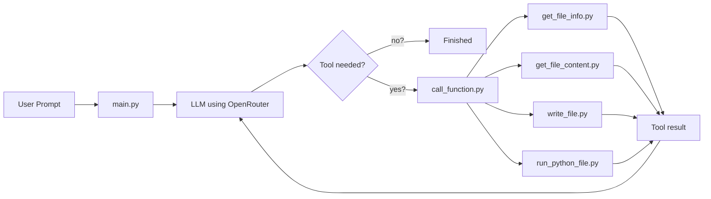
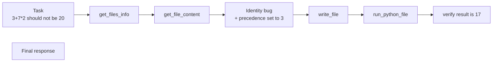

# Build AI Agent
This project is a Command-Line AI agent with Python and OpenRouter
The program takes a prompt user wrote in the terminal, sends it to an AI model through OpenRouter, 
and finally prints the response

## Requirements
- Python 3
- uv
- OpenRouter API Key

## How it works
The program requires a user prompt:
Example: uv run main.py "Talk about Mount Everest, no more than one paragraph"
Then, the AI response will be printed in the terminal

The agent follows a feedback loop as follow:

The agents uses Four tools:
- get_files_info which lists files and dictionaries
- get_file_content which reads file contents
- write_file which overwrites contents or creates of a file
- run_python_file which runs python file ans return the result
All tools' results are added back to the conservation "messages variable" so the LLM can use them in the next iteration
Also, the agent is limited to 20 iterations to prevent an infinite loops.

## Example of Fixing a Bug
Suppose the user gives the agent:
Fix the bug: 3 + 7 * 2 shouldn't be 20.
The agent can reason through the project using its tools.

## Configuration
Create a .env file and put inside it you OpenRouter API Key as
OPENROUTER_API_KEY=your_api_key_here
And be sure to be included in .gitignore file.
